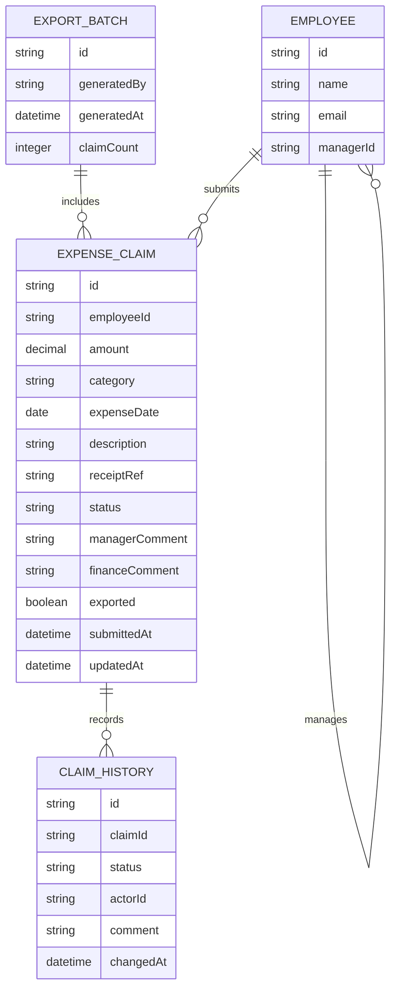

# Domain Model

The system centers on the expense claim as it moves from employee submission
through manager and finance review to payroll export, plus the
employee-manager assignments that route each claim to its approver.

- **EMPLOYEE** — every person in the system (employee, manager, or finance
reviewer); `managerId` self-references EMPLOYEE to encode the reporting
line finance maintains.
- **EXPENSE\_CLAIM** — `status` moves through `submitted` →
`manager-approved` → `finance-approved` (or `rejected` at either step, back
to the employee) → `exported`; `exported` flips once a batch includes it.
- **CLAIM\_HISTORY** — an audit trail of every status change, who made it, and
any comment.
- **EXPORT\_BATCH** — one row per CSV export finance generates, so an already
exported claim is never included again.

