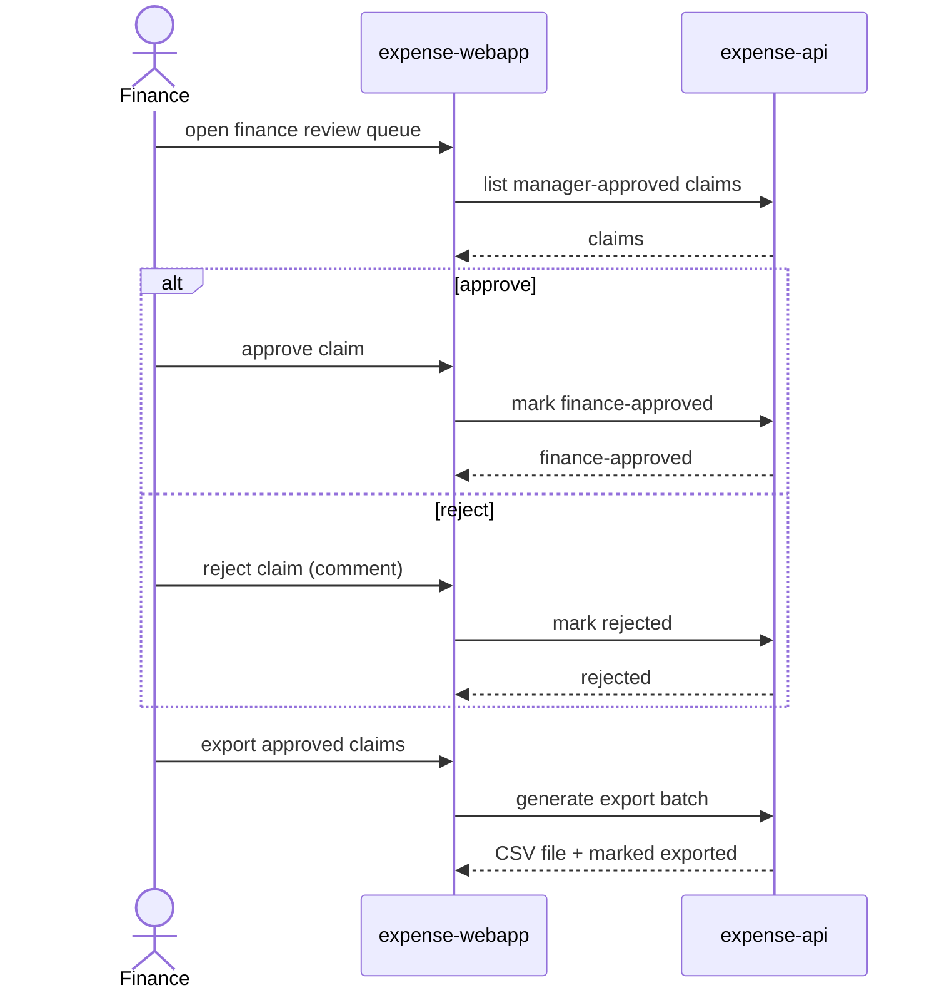

# Payroll Export

Finance gives the final review on manager-approved claims, then exports
finance-approved claims to a payroll-ready CSV file that marks each claim as
exported.

```mermaid
sequenceDiagram
    actor Finance
    participant expense-webapp
    participant expense-api

    Finance->>expense-webapp: open finance review queue
    expense-webapp->>expense-api: list manager-approved claims
    expense-api-->>expense-webapp: claims

    alt approve
        Finance->>expense-webapp: approve claim
        expense-webapp->>expense-api: mark finance-approved
        expense-api-->>expense-webapp: finance-approved
    else reject
        Finance->>expense-webapp: reject claim (comment)
        expense-webapp->>expense-api: mark rejected
        expense-api-->>expense-webapp: rejected
    end

    Finance->>expense-webapp: export approved claims
    expense-webapp->>expense-api: generate export batch
    expense-api-->>expense-webapp: CSV file + marked exported
```

