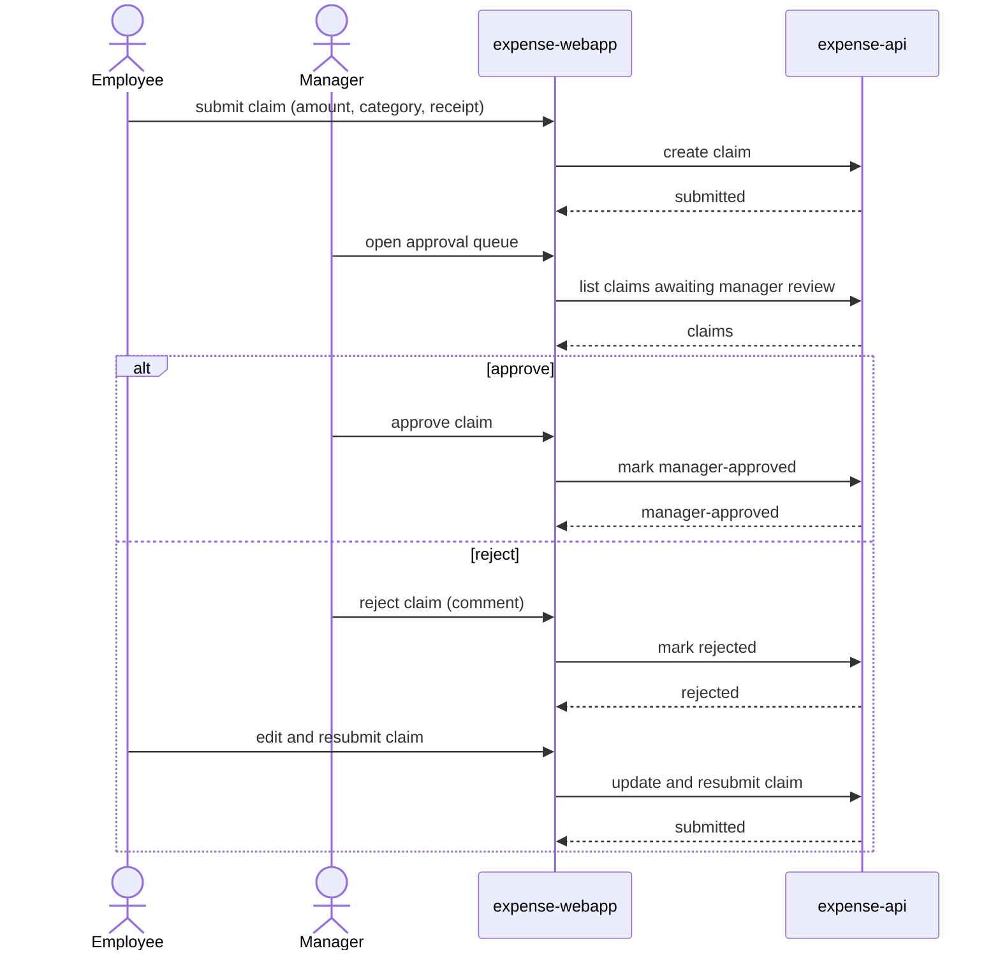

# Submit and Approve Claim

An Employee submits an expense claim and their Manager approves or rejects
it; a rejected claim returns to the Employee to edit and resubmit.

```mermaid
sequenceDiagram
    actor Employee
    actor Manager
    participant expense-webapp
    participant expense-api

    Employee->>expense-webapp: submit claim (amount, category, receipt)
    expense-webapp->>expense-api: create claim
    expense-api-->>expense-webapp: submitted

    Manager->>expense-webapp: open approval queue
    expense-webapp->>expense-api: list claims awaiting manager review
    expense-api-->>expense-webapp: claims

    alt approve
        Manager->>expense-webapp: approve claim
        expense-webapp->>expense-api: mark manager-approved
        expense-api-->>expense-webapp: manager-approved
    else reject
        Manager->>expense-webapp: reject claim (comment)
        expense-webapp->>expense-api: mark rejected
        expense-api-->>expense-webapp: rejected
        Employee->>expense-webapp: edit and resubmit claim
        expense-webapp->>expense-api: update and resubmit claim
        expense-api-->>expense-webapp: submitted
    end
```

